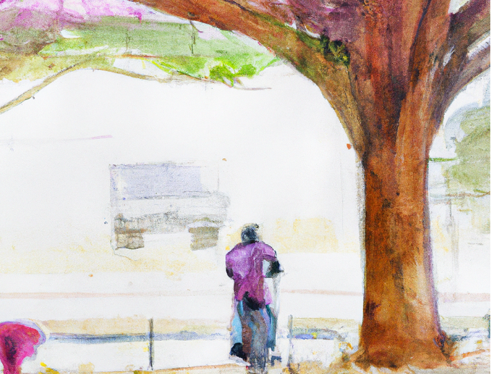

I have recently worked with the team in building an object detection software system for retail, and from all object detection algorithms and their implementations, we chose YOLO.

YOLO is a real-time object detection algorithm that can identify objects in an image and provide their bounding boxes and class probabilities in a single forward pass of a neural network.

The original paper of YOLO ("You Only Look Once") was published in 2016 by Joseph Redmon, Santosh Divvala, Ross Girshick, and Ali Farhadi.

Here's the URL to the paper: [arxiv.org/abs/1506.02640](https://arxiv.org/abs/1506.02640)

The authors claim that YOLO is faster and more accurate than previous state-of-the-art object detection systems.

The authors also introduce a new loss function that optimizes both the localization and classification tasks simultaneously. This loss function takes into account the confidence of each predicted box and penalizes false positives and false negatives accordingly.

We found YOLO adequate for the task we had detecting items on shelves in retail stores in both performance and speed.

Having that said, the main reason we picked YOLO was the mature implementation we found from Ultralytics.

[Ultralytics](https://github.com/ultralytics/ultralytics) has developed an open-source implementation of the YOLO algorithm which has gained popularity in the computer vision community and is used in various applications.

As far as I know, the authors of the original YOLO paper (Joseph Redmon, Santosh Divvala, Ross Girshick, and Ali Farhadi) are not directly related to Ultralytics.

### In detail, here is how YOLO works:

1. Dividing the image into a grid: YOLO divides the input image into a grid of cells. Each cell is responsible for detecting objects that fall within its boundaries.

2. Predicting bounding boxes: For each cell, YOLO predicts several bounding boxes, which are defined by their center coordinates, width, height, and confidence score. The confidence score represents how likely the bounding box contains an object.

3. Predicting class probabilities: For each cell and bounding box, YOLO predicts the probability of each object class. The class probabilities are independent of each other, which means that YOLO can detect multiple objects in a single cell.

4. Non-maximum suppression: After predicting the bounding boxes and class probabilities, YOLO uses a technique called non-maximum suppression to eliminate duplicate detections and select the most likely ones.

5. Outputting the results: Finally, YOLO outputs the selected bounding boxes and their associated class probabilities, which represent the detected objects and their locations in the input image.

The YOLO algorithm achieves [state-of-the-art performance](https://paperswithcode.com/sota/object-detection-on-pascal-voc-2007) on the PASCAL VOC detection benchmark and can process images in real-time with a speed of 45 frames per second on a Titan X GPU.

Since the original YOLO algorithm has been introduced, several versions have been published by researchers:

- YOLO V2: Anchor with K-means added, two-stage training, full convolutional network;
- YOLO V3: Multi-scale detection by using FPN;
- YOLO V4: SPP, MISH activation function, data enhancement Mosaic/Mixup, GIOU(Generalized
Intersection over Union) loss function;
- YOLO V5: Flexible control of model size, application of Hardswish activation function, and data 
enhancement

In addition to Ultralytics implementation I mentioned above, there are several other open-source implementations of YOLO algorithm. Some popular ones are:

- [Darknet](https://github.com/pjreddie/darknet): Darknet is the original implementation of YOLO, developed by Joseph Redmon, one of the authors of the YOLO paper. Darknet is written in C and CUDA, and it supports both CPU and GPU acceleration.

- [TensorFlow-YOLOv4](https://github.com/hunglc007/tensorflow-yolov4-tflite): This is the most popular implementation of YOLOv4 on GitHub judged by the number of starts. It uses TensorFlow 2.0 and supports both CPU and GPU acceleration.

- [Keras-YOLOv3](https://github.com/qqwweee/keras-yolo3): This is an implementation of YOLOv3 developed by qqwweee. It is written in Keras and supports both CPU and GPU acceleration.

### References
*A Review of Yolo Algorithm Developments Peiyuan Jiang, Daji Ergu, Fangyao Liu, Ying Cai, Bo Ma, The 8th International Conference on Information Technology and Quantitative Management.*

*You Only Look Once: Unified, Real-Time Object Detection, Joseph Redmon∗ , Santosh Divvala, Ross Girshick, Ali Farhadi*

----
Salam
