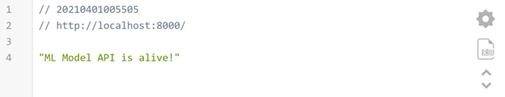
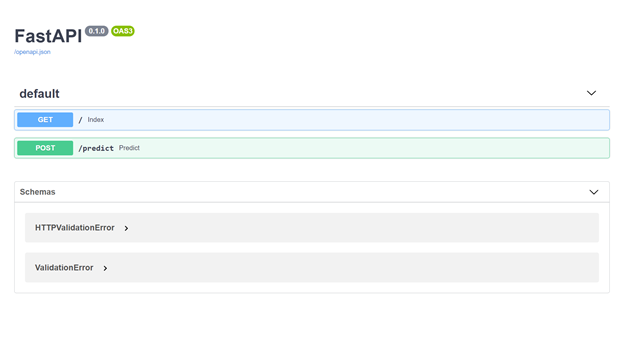
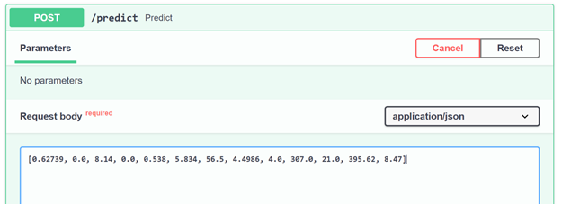
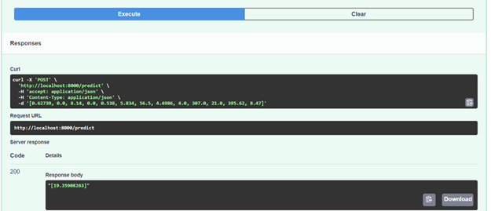

In this post, I will describe a recipe for ML Software Engineers who want to publish their ML model built with Python using FastAPI and containerize it using Docker. This is one of the steps towards making the model ready to be deployed to the production environment, whether it is on-premise or on the cloud.

FastAPI is a modern, high-performance Python web framework that is perfect for building RESTful APIs. It can handle both synchronous and asynchronous requests and has built-in support for data validation, JSON serialization, authentication and authorization, and OpenAPI.

At the same time, Docker is a containerization technology that has changed the way we ship our applications forever. Now, we deploy containers that reuse most of the underlying host operating system and add only the needed layers for our software to run! Containers also help us to horizontally scale our application by starting and stopping additional instances depending on the current demand.

### Create ML Model
We will not start from scratch but rather use one of the datasets provided with the scikit-learn library and build a simple regression model on top of it. We will take the Housing dataset, which contains information about different houses in Boston. This data was originally part of the UCI Machine Learning Repository. There are 506 samples and 13 feature variables in this dataset. The objective is to predict the value of the prices of the house using the given features. Here is our simple linear regression to achieve that:

```python
import pickle
import numpy as np
import sklearn.datasets as datasets
from sklearn.linear_model import LinearRegression
from sklearn.model_selection import train_test_split

def fit():
    house = datasets.load_boston()
    train_x, test_x, train_y, test_y = train_test_split(house.data, house.target, test_size=0.2, random_state=1)
    lr = LinearRegression()
    lr.fit(train_x, train_y)
    pickle.dump(lr, open('./models/lr_reg_boston.h5', 'wb'))
    return

def predict(x_to_predict):
    lm_pickled = pickle.load(open("./models/lr_reg_boston.h5", "rb"))
    result = lm_pickled.predict(np.reshape(x_to_predict, (1, -1)))
    return result

if __name__ == "__main__":
    fit()
    house_to_evaluate = [0.62739, 0., 8.14, 0., 0.538, 5.834, 56.5, 4.4986, 4., 307., 21., 395.62, 8.47]
    price = predict(house_to_evaluate)
    print(f"result of predciton of {house_to_evaluate} is {str(price[0])} 1000s USD")
```

Our code has two methods, `fit` and `predicts`, fit method loads the dataset and uses scikit-learn to split the data into train and test sets then it trains a linear regression algorithm and saves the resulting model to the disk. The Predict method starts by loading the trained model and then passing in a sample house vector of feature values to predict its price. Save this code to boston_housing.py and run it with python boston_housing.py to train and generate the model.

### Publishing Linear Regression Model  with FastAPI

FastAPI is our API server of choice for the reasons we explained earlier. Here is the code:

```python
import uvicorn
from fastapi import FastAPI
import boston_housing
#
app = FastAPI()
#
@app.get("/")
def index():
    return 'ML Model API is alive!'
#
@app.post("/predict")
def predict(house_to_evalute: list):
    prediction = boston_housing.predict(house_to_evalute)
    return str(prediction)

if __name__ == "__main__":
    uvicorn.run(app, host="0.0.0.0", port=8000)
```

The predict method basically handles HTTP post type of requests, it expects the payload of the request to contain a vector of feature values, it then uses the model we trained and generate before to predict the price.

### Containerize your FastAPI ML Model

Now, let’s create a Dockerfile for our model.  If our model runs correctly then all we have to do is to write Dockerfile for it, this way we can use to build a docker image and then spin a container out of it.

We will keep our Dockerfile in the build context which is the folder containing the application and dependencies and it should read as the following:

```sh
FROM python:3.7.6
WORKDIR .
COPY requirements.txt .
RUN pip install -r requirements.txt
COPY ./ .
EXPOSE 8000
CMD ["uvicorn", "app:app", "--host", "0.0.0.0", "--port", "8000"]
```

Here we simply start from base image pyhon:3.7.6, on top of that we install requirements using `pip install`, we then copy all our files from the current directory to the image root directory, we tell docker that we want to expose port 8000 from our image. Finally, we run our application using the `CMD` command.

One comment here is that in production you would like to use gunicorn instead of unvicorn, consequently we need to change the CMD to look like the following

### Build and Run

Now we have created our Dockerfile we can build an Image for our model using docker build command as the following, we start your Docker desktop and on the root folder of our model we issue the following command from the terminal:

```docker build -t housing_price_pred_model .```

If we ls the docker images we find:

```sh
(venv) G:\0Yaser\repos\ml_model_containerized>docker image ls
REPOSITORY                        TAG                 IMAGE ID            CREATED             SIZE
housing_price_pred_model          latest              cc6b1383c057        52 seconds ago      1.29GB
```

And to run a container based on our image we use the following command:

```sh
docker run -d --name housing_price_pred_model_container -p 8000:8000 housing_price_pred_model
```

```sh
(venv) G:\0Yaser\repos\ml_model_containerized>docker container ls
CONTAINER ID        IMAGE                      COMMAND             CREATED             STATUS              PORTS                    NAMES
a181597082ed        housing_price_pred_model   "python app.py"     7 seconds ago       Up 6 seconds        0.0.0.0:8000->8000/tcp   housing_price_pred_model_container
```

Now we can go to http://localhost:8000 to check if our API server is alive:



We point to the automatically generated swagger documentation for our API's on http://localhost:8000/docs



Finally, we can test our predict API like:





The full code of this post is [github.com/ml_model_containerized](https://github.com/YaserMarey/ml_model_containerized)

----
Stay safe, 

Salam,


