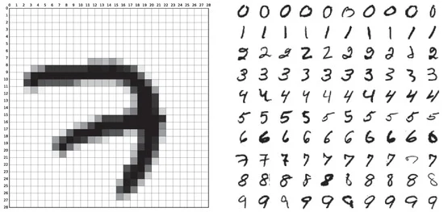

The great OCR was one of the earliest Neural Network applications. The utility of converting hand or machine-written text from scanned documents to machine-encoded text format was and still huge.

In 1998 Yann LeCun, currently, Chief AI Scientist at Facebook was working at Bell Labs on an OCR that recognizes the set of digits from 0 to 9 to be deployed and used in banks, and post offices to recognize check numbers and zip codes.

The application was a success and as a by-product of their work LeCun, who later led the invention of Convolutional Neural Network ( LeNet-5), he and his team produced MINST dataset.

The dataset, which contains 60,000 training and 10,000 testing different images of 0–9 handwritten digits, then led a life on its own and became the benchmark for supervised learning algorithms.

The MNIST is created by modifying samples from NIST or The National Institute of Standards and Technology original datasets and hence the M in the name.

Almost 20 years later and in 2017 a group of researchers collected a drop-in replacement they called Fashion-MNIST which is a dataset of Zalando’ s fashion articles ( shoes, bags, pants .. and who cares) images consisting again of 60,000 training and 10,000 testing images classified into 10 classes.

The Fashion-MNIST creators were bold enough to propose this dataset as a new benchmark for Computer Vision image classification algorithms claiming that MNIST is a solved problem and no longer enough challenge, which I think is true!

Extended MNIST or EMNIST is also introduced the same year 2017. This time the dataset includes both digits and letters.

Yet another variation following MNIST tradition is Kaggle American Sign Language MNIST presented also 2017. The dataset contains thousands of images of hand gestures representing 24 English letters (excluding J and Z which require motion).

When learning any new programming language there is always the “Hello World” example which is the starting point, and experimenting with MNIST dataset for me is like the Hello World for Computer Vision, Image Classification, and Neural Networks.

----
Stay safe, 

Salam,

