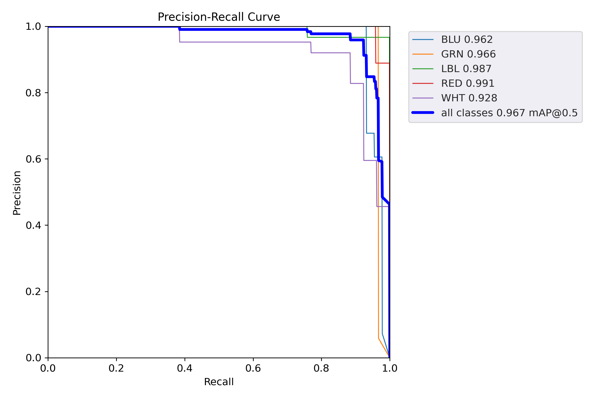
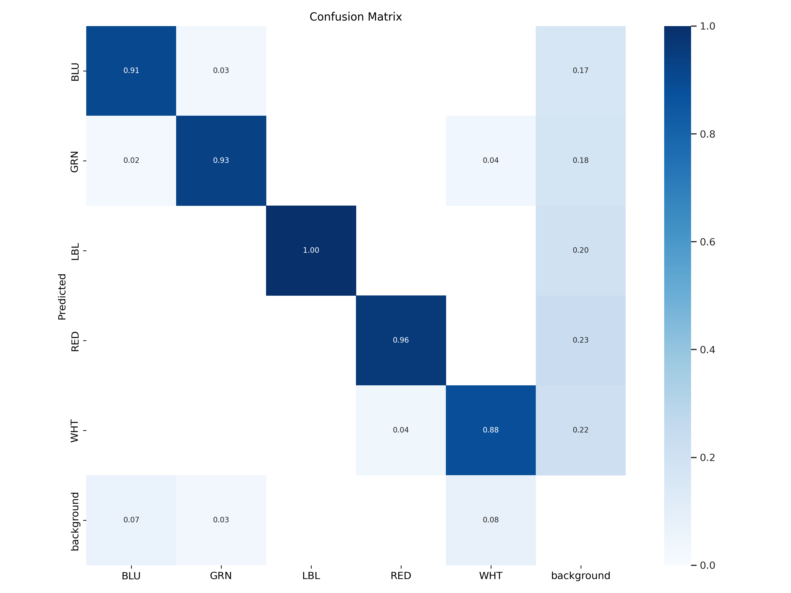

When addressing a problem with a supervised learning machine-learning solution we spend most of the time working on data labeling.

Data labeling unexpectedly requires attention from an engineering perspective, we need to look into how we will label our data and the challenges that come with each method. First, we have hand labeling.

1. **Hand labeling**

    The most common labeling method, is the easiest to set up but it has clear drawbacks. It is ***Expensive*** since it usually requires a subject matter expert, or even a group of them, for example in medicine x-rays labeling requires a board-certified radiologist. Also with manual labeling, we have also to understand the ***Data Privacy restrictions***. For example in some cases, we may not be able to share data with an external team to label it. Manual labeling is also ***Time-consuming*** which leads to slow iteration and also means that the model update is less frequent than sometimes needed.

2.  **Natural Labels**

    Depending on the data we are working on, it happens that data samples labeled with ground truth labels are available. For example for stock prices, actual historical prices are known. In other cases, we can collect feedback from the user either agreeing or disagreeing with the predictions we are making through our model. This happens for example on eCommerce websites, where actual customer selections are known and we can use this to train our recommendation system.

3. **Semi-Supervision**

    Semi-Supervision is an approach that has proven to be useful to avoid labeling the entire data set. We simply train on a small set of hand-labeled samples and then use the model to predict, add the high-confidence predicted samples to the training data, and then train again, and so on.
    Another semi-supervision method relies on labeling a small set of samples and then using clustering to label similar samples with the same label.

4.  **Transfer Learning**
    This is another possible solution to avoid hand labeling. Here we just use a pre-trained model on a different dataset. We might only need to label a few data samples to fine-tune the pre-trained model.

### Labeling Problems

1. **Multiplicity**

    This happens when the same sample is annotated with two different and conflicting labels by two annotators. This problem is inevitable. Something we can do is to clearly define the problem and the rules we want annotators to work with, apply quality checks on labels, and define conflict resolution rules.

2. **Data Lineage**

    This technique is all about tracking the sources of the data and sources of labels. This is important and helps in tracking changes in model performance due to the introduction of new data samples.

3. **Class Imbalance**

    Class Imbalance is a common problem with data labeling. It refers to the case when the number of samples varies drastically among label classes. 
    
    ML algorithms tend to work well when the distribution of training data label classes is balanced. A couple of things to notice here is that our model must learn from data and not merely reflect the data distribution, second in some cases we prefer that our model perform well in finding less frequent classes than to perform well overall for example in medicine we want to have less number of false negative diagnosis even if this would mean more false positives. 
    
    To overcome the call imbalance problem we can:

    - Select the evaluation metric carefully. From my experience, two tools that are particularly helpful are ***Prescioin vs Recall curve*** similar to this from one of our projects . PR Curve shows the trade-off between precision and recall as the classification threshold changes. The curve is used to find the optimal threshold that balances precision and recall, depending on the requirements of the specific problem at hand. For example, in medical diagnosis, it is often more important to have a high recall, to ensure that all positive cases are detected, even if this results in a lower precision. On the other hand, in spam filtering, it is often more important to have high precision, to ensure that only legitimate emails are classified as such, even if this results in a lower recall. 
    
    The second tool is the ***Confusion Matrix***  which is a table used to evaluate the performance of a classifier. In the context of multi-class classification, it allows us to visualize the performance of the classifier by comparing the predicted class labels with the true class labels. Each row in the confusion matrix represents the actual class, and each column represents the predicted class. 
    - Now that we have better tools to evaluate model performance in a multi-class setting where we have class imbalance problem we experiment with the following methods to enhance the model performance:

        -   **Undersampling**: This involves reducing the size of the majority class by randomly removing samples from it to create a balanced dataset.

        -   **Oversampling**: This involves generating new samples for the minority class until it reaches a balance with the majority class.

        -   **Synthetic data generation**: This involves using techniques like SMOTE (Synthetic Minority Over-sampling Technique) to generate synthetic data for the minority class.

        -   **Class weighting**: This involves adjusting the weight of the loss function so that the model pays more attention to the minority class.

        -   **Ensemble methods**: This involves combining multiple models either by bagging, boosting, or stacking to create an ensemble that can better handle class imbalance.

        -   **Modifying the decision threshold**: By default, classifiers make predictions based on a threshold of 0.5, but this can be adjusted to balance precision and recall for imbalanced classes.
        
That is it for now!

----

Stay safe, 

Salam,

