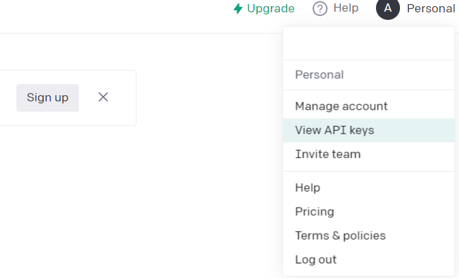
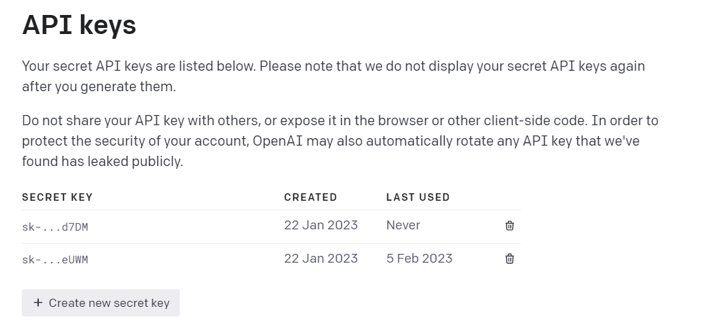
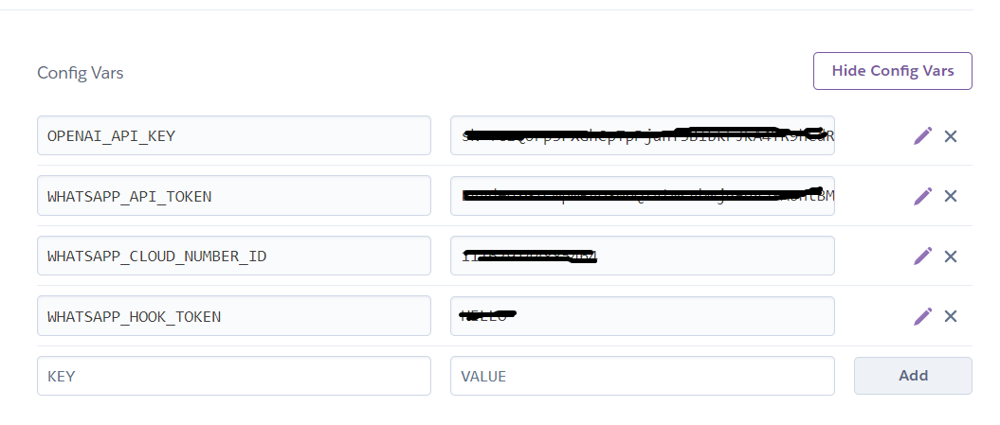
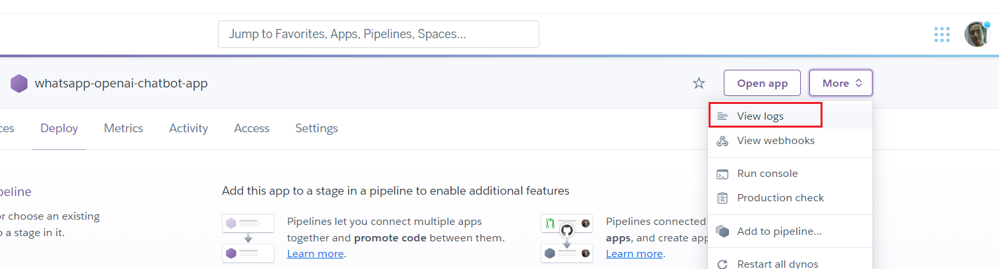
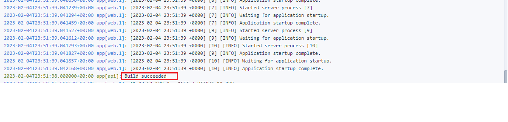
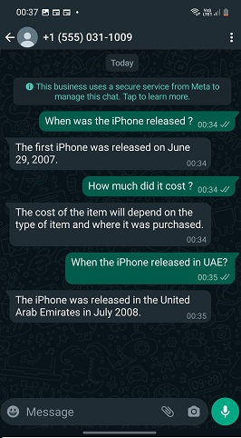

## Text Completion using OpenAI Language Models

In [Part 1](https://yasermarey.github.io/building_openai_whatsapp_1/building_openai_whatsapp_1.html), we wrote a simple WhatsApp Cloud API wrapper that sends messages. 

In [Part 2](https://yasermarey.github.io/building_openai_whatsapp_2/building_openai_whatsapp_2.html), we added a webhook to receive messages from the customer.

In this part, we will write a wrapper for OpenAI APIs to enable our application to use the received message from the customer as a prompt to GPT-3. 

Let's start! The steps we need to take are as follows:

## Steps
1. Create an account and obtain the API key from OpenAI.
2. Add OpenAI_API_KEY to the Heroku application environment variable.
3. Create openai_clinet.py and modify webhook.py
4. Deploy updates to Hroku app.

Here are the steps in more detail:


***Step 1***

Go to the OpenAI website (https://www.openai.com) and create an account. Log in to your account and then from the left side menu click *View API Keys* 

Then click *Create new secret key* 


***Step 2***

Open the Heroku dashboard, and select the application we created in our last post. from settings click "Reveal Config Vars" and then add API Key to the Environment Variables 


***Step 3***

Create **openai_client.py** on the root of the source folder of the application we created last post as the following:

```python
#openai_client.py
import os
import openai

class OpenAIClient:
    def __init__(self):
        openai.api_key = os.environ.get("OPENAI_API_KEY")
        print ("\nopenai key is" + openai.api_key + " and its type is " + openai.api_type)

    def complete(self, prompt):
        response = openai.Completion.create(
        model="text-davinci-003",
        prompt=prompt,
        temperature=0.0,
        max_tokens=256,
        top_p=1,
        frequency_penalty=0,
        presence_penalty=0
        )

        print ("response form openai is :\n" + str(response) + "\n")
        return response.choices[0].text
 
```
This code is a simple wrapper for the oepnai.Completion.create() API.

The `openai.Completion.create` method is used to create a new completion request to the OpenAI API. To use it, you need to provide a prompt, a model ID, and your API key.

You can find more information about the API and its parameters in the OpenAI API documentation: [https://beta.openai.com/docs/api-reference/completions/]https://beta.openai.com/docs/api-reference/completions/create

The important parameters we want to notice are: `engine` which is the ID of the language model you want to use to generate the completion. For example, `text-davinci-003` and the `prompt` which is the seed text that we want to use as the starting point for the completion.

Now we need to modify webhook.py to construct and call `OpenAIClient.complete(prompt)` method as the following:

```python
# webhook.py
# ...
# ...
@app.post("/webhook/")
async def callback(request: Request):
    print("callback is being called")
    wtsapp_client = WhatsAppClient()
    data = await request.json()
    print ("We received " + str(data))
    response = wtsapp_client.process_notification(data)
    if response["statusCode"] == 200:
        if response["body"] and response["from_no"]:
            # Add this line
            openai_client = OpenAIClient()
            # Add this line too
            reply = openai_client.complete(prompt=response["body"])
            # Comment the below line
            # reply = response["body"]
            print ("\nreply is:"  + reply)
            wtsapp_client.send_text_message(message=reply, phone_number=response["from_no"], )
            print ("\nreply is sent to whatsapp cloud:" + str(response))

    return {"status": "success"}, 200```
```

***Step 4***

To prepare to deploy our update to Heroku, add openai to the requirements.txt

```sh
fastapi==0.89.1
openai==0.26.1
python-dotenv==0.21.1
requests==2.22.0
uvicorn==0.20.0
gunicorn==20.1.0
```

We deploy our changes to Heroku application we created the last post.

Stage all source files, commit, and push

```sh
$ git add .; git commit -am"adding openai_client call"; git push keroku master
```

You can see Heroku deploying your application from the logs:


Check that your application is successfully built and started from the dashboard



If all went ok, we can send messages to Chat GPT-3, specifically `text-davinci-003` over WhatsApp



Voila! we have all pieces in place, this last one was fun, and we have a completely running WhatsApp bot powered by GPT-3!

Thank you for reading, if you find this useful please follow me for more content.

The complete [source code](https://github.com/YaserMarey/whatsapp_openai_chatbot) for this series is available [@github](https://github.com/YaserMarey/whatsapp_openai_chatbot)

----
Salam,
