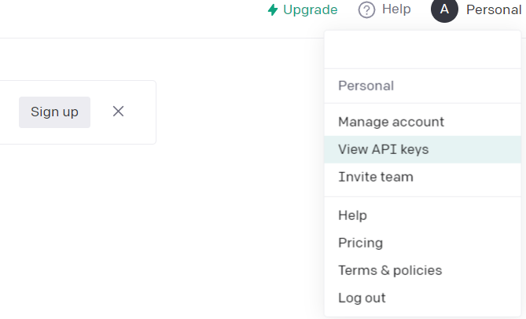
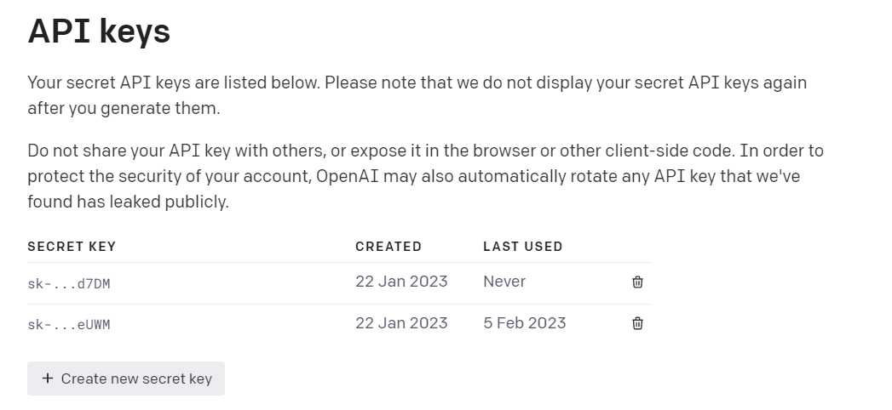
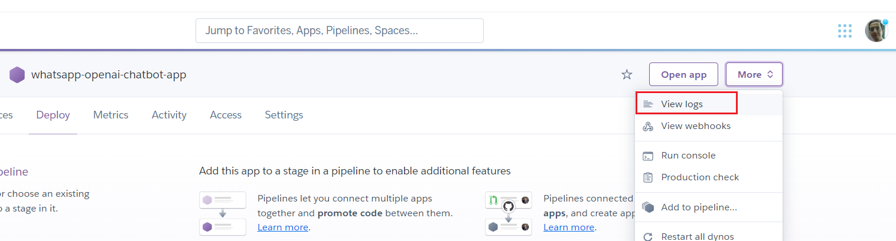
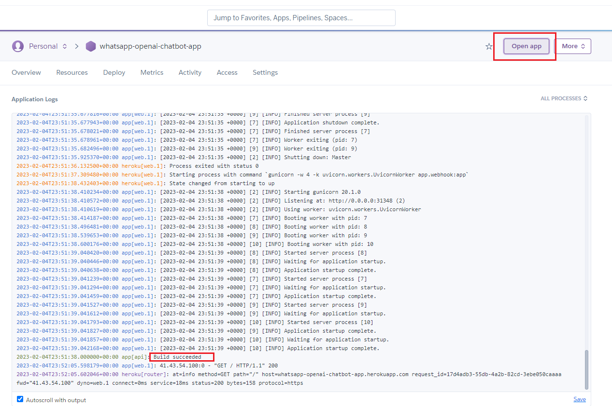

# Building WhatsApp Chatbot powered by OpenAI GPT-3! - 3

# Text Completion using OpenAI Language Models

Follow along as we walk through the steps of building a WhatsApp Chatbot powered by OpenAI GPT-3 using Python, WhatsApp Cloud API, and a FastAPI Webhook published on Heroku.

#### This is part - 3 of a series of three posts, the other two parts are:
#### Part - 1: [Sending Messages using WhatsApp Cloud API](https://yasermarey.github.io/building_openai_whatsapp_1/building_openai_whatsapp_1.html)
#### Part - 2: [ Receiving Messages from WhatsApp Cloud API using Webhooks](https://yasermarey.github.io/building_openai_whatsapp_2/building_openai_whatsapp_2.html)

In Part 1, we wrote a simple WhatsApp Cloud API wrapper that sends messages. 

In Part 2, we added a webhook to receive messages from the customer.

In this part, we will write a wrapper to OpenAI API's to enable our application to use the received message from the customer as a prompt to GPT-3 and then reply to the customer accordingly. 

Let's start! The steps we need to take are as follows:

## Steps
1. Write an account on OpenAI and obtain API Key.
2. Add OpenAI_API_KEY to the Heroku application environment variable.
3. Install open
4. Test receiving messages from a customer test number

Here are the steps in more detail:


***Step 1***

Create an account and obtain the API key from OpenAI.




***Step 2***
Open the Heroku dashboard, and select the application we created in our last post. from settings click "Reveal Config Vars" and then add API Key to the Environment Variables 


***Step 3***
Create openai_client.py on the root of the source folder of the application we created last post as the following:

```python
import os
import openai

class OpenAIClient:
    def __init__(self):
        openai.api_key = os.environ.get("OPENAI_API_KEY")
        print ("\nopenai key is" + openai.api_key + " and its type is " + openai.api_type)

    def complete(self, prompt):
        response = openai.Completion.create(
        model="text-davinci-003",
        prompt=prompt,
        temperature=0.0,
        max_tokens=256,
        top_p=1,
        frequency_penalty=0,
        presence_penalty=0
        )

        print ("response form openai is :\n" + str(response) + "\n")
        return response.choices[0].text
 
```
This code is a simple wrapper for the oepnai.Completion.create() API.
The important parameter we need to pass in is the prompt we would like GPT-3 to compete for us.

Now we need to modify webhook.py to construct and call OpenAIClient.complete(prompt) method as the following:

```python
# webhook.py
# ...
# ...
@app.post("/webhook/")
async def callback(request: Request):
    print("callback is being called")
    wtsapp_client = WhatsAppClient()
    data = await request.json()
    print ("We received " + str(data))
    response = wtsapp_client.process_notification(data)
    if response["statusCode"] == 200:
        if response["body"] and response["from_no"]:
            # Add this line
            openai_client = OpenAIClient()
            # Add this line too
            reply = openai_client.complete(prompt=response["body"])
            # Comment the below line
            # reply = response["body"]
            print ("\nreply is:"  + reply)
            wtsapp_client.send_text_message(message=reply, phone_number=response["from_no"], )
            print ("\nreply is sent to whatsapp cloud:" + str(response))

    return {"status": "success"}, 200```
```
***Step 4***
To prepare to deploy our update to Heroku, add openai to the requirements.txt

```sh
fastapi==0.89.1
openai==0.26.1
python-dotenv==0.21.1
requests==2.22.0
uvicorn==0.20.0
gunicorn==20.1.0
```

***Step 5***

We deploy to Heroku by pushing the source to a Heroku git repository that Heroku associates with our application.
From the Heroku application dashboard ***deploy*** page, follow the link to install Heroku CLI and then log in:

```sh
$ heroku login
```
Stage all source files, commit, and push

```sh
$ git add .; git commit -am"adding openai_client call"; git push keroku master
```

You can see Heroku deploying your application from the logs:


Check that your application is successfully built and started from the dashboard


or using the command line

```sh
$ heroku open
```

In both cases you should see a new browser tab like this:


***step 6***

We now can test your webhook by sending a message to the WhatsApp Meta Cloud API Business number we received a template message on before in part 1 of this series, and if things went ok then we should see it echoed back to us.


If anything went wrong we can check Heroku Logs.

Voila!, we have all pieces in place, this last one was straightforward and fun, and we have a completely running WhatsApp bot powered by GPT-3!

Thank you for reading, if you find this useful please follow me for more content.

The complete [source code](https://github.com/YaserMarey/whatsapp_openai_chatbot) for this series is available [@github](https://github.com/YaserMarey/whatsapp_openai_chatbot)

----
Salam,
