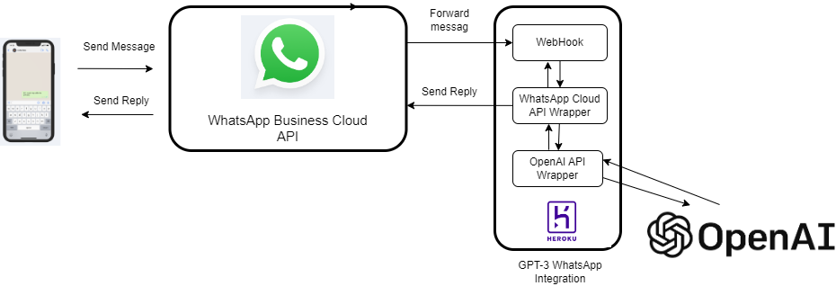
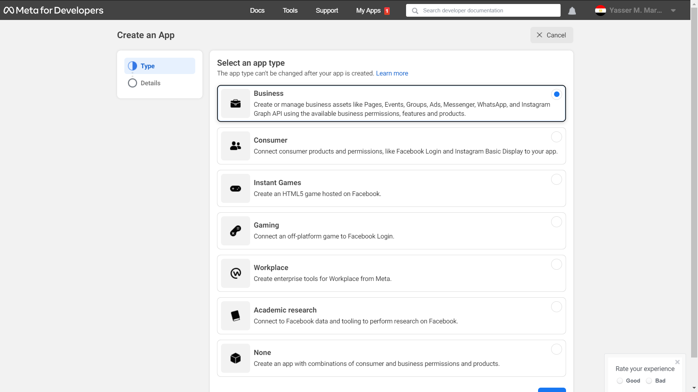
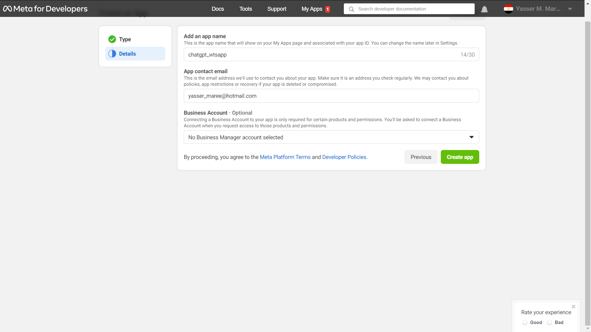
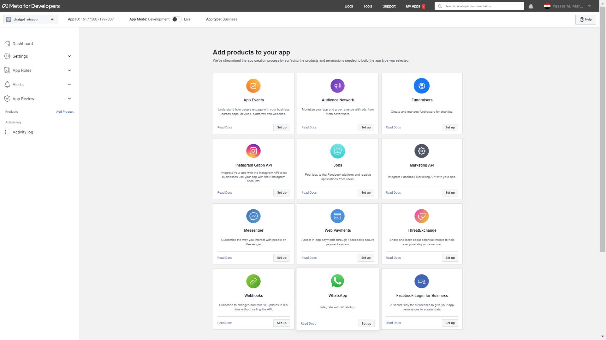
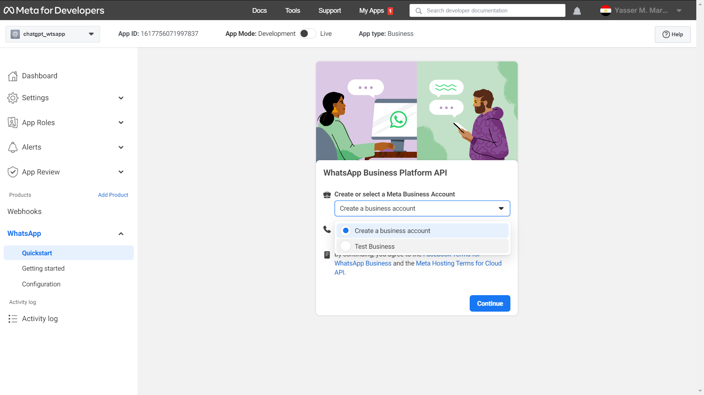
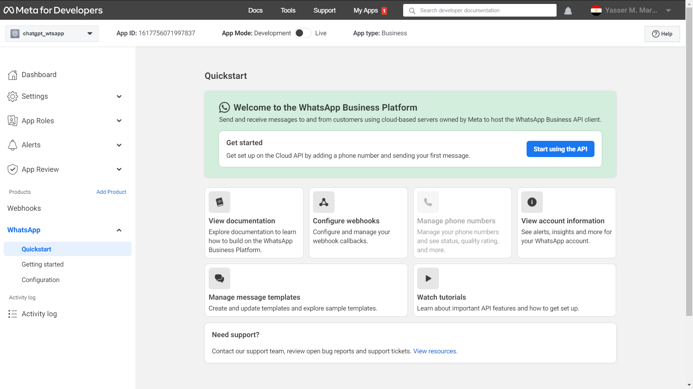
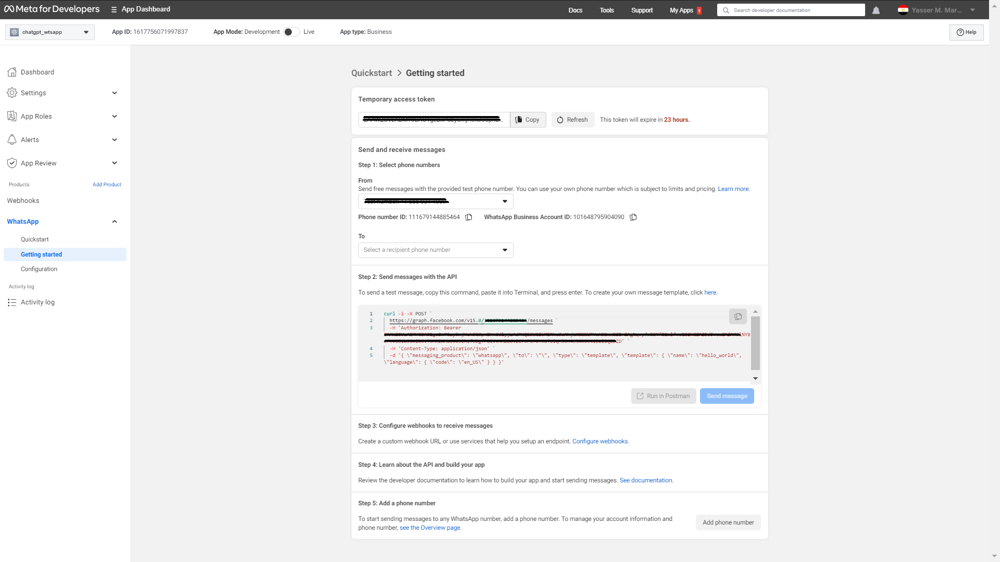
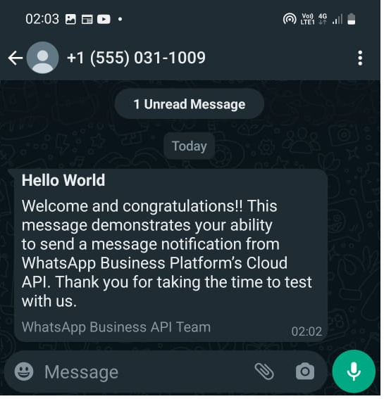

# Building WhatsApp Chatbot powered by OpenAI GPT-3! - 1

### Using Python, WhatsApp Cloud API, and a FastAPI Webhook Published on Heroku


Follow along as we walk you through the steps of building WhatsApp Chatbot powered by OpenAI GPT-3 using Python, WhatsApp Cloud API, and a FastAPI Webhook published on Heroku.


#### This is part - 1 of a series of three posts:
#### Part - 1: Sending Messages using WhatsApp Cloud API 
#### Part - 2: Receiving Message from WhatsApp Cloud API using WebHooks
#### Part - 3: Text Completion using OpenAI Language Models


***I will update the links to parts 2 and 3 once they are done, follow me to receive notifications once they are published***

Recently we were building a chat interface for a Call Center for one of the utility companies here in Egypt. We were about to start using Twilio APIs just to know that Metas started to allow anyone to integrate their software systems directly with WhatsApp through WhatsApp Business Platform Cloud API without a middleware such as Twillio!

That was interesting, but we wanted also to add a chatbot to the call center workforce, so when a customer chats in complaining or enquiring he or she will be initially routed to a bot agent before a human can engage with the customer if needed. To our benefit we have now chatGPT which although not that fluent in Arabic "yet" it opens new interesting possibilities of free chat dialog between customers and chatbots rather than templated replies with options to choose from as we were originally planning to build.

Imagine the potential of fine-tuning a GPT-3 model with a specific corpus collected from past chat history with human agents. It could become an expert in handling Egyptian customers!

In this post, I'll give you an overview of the steps to configure WhatsApp Cloud API and send a test message. In the next post, I'll set up a webhook to receive messages from customers, and in the final post, I'll use OpenAI's "still" free API to send back GPT-powered replies.

***Disclaimer*** the LLMS currently available through OpenAI API is not as powerful as what you can experience on [chat.openai.com](https://chat.openai.com/chat), but they've promised it will improve soon. Check out their tweet for more info: [twitter.com](https://twitter.com/OpenAI/status/1615160228366147585)

I may also add a fourth post, this final post will be about fine-tuning GPT-3 model to a specific dataset.

Let's start,

First here is a schematic diagram of what we want to build



The general steps we need to take for part 1 are as the following:
1- Create a business app on Facebook.
2- Configure and test the WhatsApp outbound message API sending messages.
3- Send messages from WhatsApp Cloud APIs using Python Code.

Here are the steps in detail:

***Step 1*** 
Login to your Facebook developer account and click on the Create App button and choose the ***Business*** type app option and then click the next button below.


We select a name that Meta will use to refer to our application on the application's dashboard, we will choose ***chatgpt_wtsapp***, fill in my email and click next.


The application is created but we need to add a Meta Product to it, in our case this would be ***WhatsApp***. We need to click the Setup button on the WhatsApp product card at the bottom of the page.


One more screen to go, now you just need to select a business account or create one if there is no account created before, and then hit create button.


Now click the "Start Using the API" button and follow on to the next step.

Take note of ***WhatsApp Temporary Access Token***
Step 2
Most of the configuration is done now, all that we need to do is to add a phone number to test sending messages to it from WhatsApp Cloud API.

Select that number and now we can test sending the message by hitting "Send Message" or by copying the ```crul``` command to your terminal and running it. Upon doing either of these you should receive a message on the test number you selected, the message should be  similar to this:

Take note of the ***Phone Number ID***.

Step 3
Now let's write some code to wrap the WhatsApp Cloud API and use this wrapper in sending a template message similar to the one above and then relay replies we will receive later from OpenAI. 
Fire your preferred code editor, my preference is Visual Studio Code with Python Extensions, and start building a WhatsApp cloud API wrapper:

In the folder you will create your code in, create a virtual environment:
```
python -m venv venv
``` 
Install requests, and 

```sh
pip install requests python-dotenv
```
Create .evn file and set the following keys with WhatsApp Temporary Access Token and Phone Number Id from the above steps.
```sh
WHATSAPP_API_TOKEN=
WHATSAPP_CLOUD_NUMBER_ID=
```
Create whatsapp_client.py and copy the following code:
```python
# whatsapp_client.py
import os
import requests
import json
import config
from dotenv import load_dotenv

load_dotenv()

class WhatsAppWrapper:

    API_URL = "https://graph.facebook.com/v15.0/"
    WHATSAPP_API_TOKEN = os.environ.get("WHATSAPP_API_TOKEN")
    WHATSAPP_CLOUD_NUMBER_ID = os.environ.get("WHATSAPP_CLOUD_NUMBER_ID")

    def __init__(self):
        self.headers = {
            "Authorization": f"Bearer {self.WHATSAPP_API_TOKEN}",
            "Content-Type": "application/json",
        }
        self.API_URL = self.API_URL + self.WHATSAPP_CLOUD_NUMBER_ID

    def send_template_message(self, template_name, language_code, phone_number):

        payload = {
            "messaging_product": "whatsapp",
            "to": phone_number,
            "type": "template",
            "template": {
                "name": template_name,
                "language": {
                    "code": language_code
                }
            }
        }

        response = requests.post(f"{self.API_URL}/messages", json=payload,headers=self.headers)

        assert response.status_code == 200, "Error sending message"

        return response.status_code

if __name__ == "__main__":
    client = WhatsAppWrapper()
    # send a template message
    client.send_template_message("hello_world", "en_US", "201012345678")
```

The code is simple, but a couple of things to keep in mind: first it defines one method that sends a ***template whatsapp message*** this type of message is the only one allowed by WhatsApp Cloud Platform to be sent to customers without them initiating the conversation, so it must bef an approved message tempalte from Meta. This method is used only to test that our code can send messages. In the next section, I am adding another method that we will actually use to send replies from GPT-3. 

The second thing to notice is that in our current development mode, WhatsApp Cloud API only allows sending messages either template or regular to up to 5 pre-defined phone numbers. Notice how the phone number is used without leading + or zeros.

To source the virtual environment:
```sh
$ source venv/bin/activate
```
And run the whatsapp client with the following command:
```
python whatsapp_client.py
```
If you receive a message successfully then we are done, 
To prepare for the following task of receiving messages and sending replies add the following method to WhatsAppClientWapper class in whatsapp_client.py 

```python
    def send_text_message(self,message, phone_number):
        payload = {
            "messaging_product": 'whatsapp',
            "to": phone_number,
            "type": "text",
            "text": {
                "preview_url": False,
                "body": message
            }
        }
        response = requests.post(f"{self.API_URL}/messages", json=payload,headers=self.headers)
        print(response.status_code)
        print(response.text)
        assert response.status_code == 200, "Error sending message"
        return response.status_code

```
This is the method we will use to send reply messages to the customer once the conversation is initiated. The only difference is the type of message is ```text``` this time and the method will fail if there is no active conversation with the phone number we are sending to.

That's it for Part 1. In Part 2, I'll show you how to receive messages from customers using a webhook and the FastAPI framework. 

Stay tuned!

The complete source code for this series is available at [github](https://github.com/YaserMarey/whatsapp_openai_chatbot)

----
Salam
