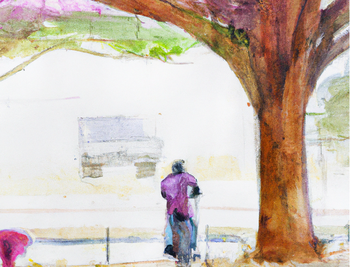

# The sotry of Yolo

The YOLO is a real-time object detection algorithm that can identify objects in an image and provide their bounding boxes and class probabilities in a single forward pass of a neural network.

The original paper of YOLO ("You Only Look Once") was published in 2016 by Joseph Redmon, Santosh Divvala, Ross Girshick, and Ali Farhadi.

Here's the URL to the paper: [arxiv.org/abs/1506.02640](https://arxiv.org/abs/1506.02640)

The authors claim that YOLO is faster and more accurate than previous state-of-the-art object detection systems.

The authors also introduce a new loss function that optimizes both the localization and classification tasks simultaneously. This loss function takes into account the confidence of each predicted box and penalizes false positives and false negatives accordingly.

In details, here is how Yolo works:

1. Dividing the image into a grid: YOLO divides the input image into a grid of cells. Each cell is responsible for detecting objects that fall within its boundaries.

2. Predicting bounding boxes: For each cell, YOLO predicts several bounding boxes, which are defined by their center coordinates, width, height, and confidence score. The confidence score represents how likely the bounding box contains an object.

3. Predicting class probabilities: For each cell and bounding box, YOLO predicts the probability of each object class. The class probabilities are independent of each other, which means that YOLO can detect multiple objects in a single cell.

4. Non-maximum suppression: After predicting the bounding boxes and class probabilities, YOLO uses a technique called non-maximum suppression to eliminate duplicate detections and select the most likely ones.

5. Outputting the results: Finally, YOLO outputs the selected bounding boxes and their associated class probabilities, which represent the detected objects and their locations in the input image.

The YOLO algorithm achieves state-of-the-art performance on the PASCAL VOC detection benchmark and can process images in real-time with a speed of 45 frames per second on a Titan X GPU.

Since the origianl Yolo algorithm has been introduced, a number of versions have been published by researchers:

- YOLO V2: Anchor with K-means added, two-stage training, full convolutional network;
- YOLO V3: Multi-scale detection by using FPN;
- YOLO V4: SPP, MISH activation function, data enhancement Mosaic/Mixup, GIOU(Generalized
Intersection over Union) loss function;
- YOLO V5: Flexible control of model size, application of Hardswish activation function, and data 
enhancement

[Ultralytics](www.Ultralytics.com) has developed an open-source implementation of the YOLO algorithm called "YOLOv5," which has gained popularity in the computer vision community and is used in various applications.  YOLOv5 is written in PyTorch and is designed to be faster and more accurate than previous versions of YOLO.

As far I know the authors of the original YOLO paper (Joseph Redmon, Santosh Divvala, Ross Girshick, and Ali Farhadi) are not directly related to Ultralytics.

However, there are several open-source implementations of the YOLO algorithm available. Some popular ones are:

- [Darknet](https://github.com/pjreddie/darknet): Darknet is the original implementation of YOLO, developed by Joseph Redmon, one of the authors of the YOLO paper. Darknet is written in C and CUDA, and it supports both CPU and GPU acceleration.

- [TensorFlow-YOLOv4](https://github.com/hunglc007/tensorflow-yolov4-tflite): This is the most popular  implementation of YOLOv4 on github gudged by number of starts. It uses TensorFlow 2.0 and supports both CPU and GPU acceleration.

- [Keras-YOLOv3](https://github.com/qqwweee/keras-yolo3): This is an implementation of YOLOv3 developed by qqwweee. It is written in Keras and supports both CPU and GPU acceleration.

### References
*A Review of Yolo Algorithm Developments Peiyuan Jiang, Daji Ergu, Fangyao Liu, Ying Cai, Bo Ma, The 8th International Conference on Information Technology and Quantitative Management.*

*You Only Look Once: Unified, Real-Time Object Detection, Joseph Redmon∗ , Santosh Divvala, Ross Girshick, Ali Farhadi*

----
Salam
